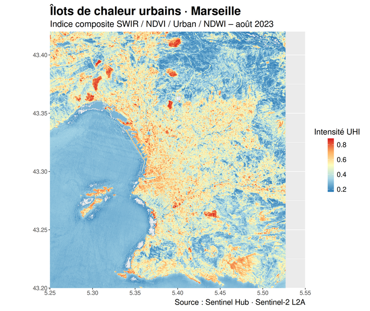

# Analyse Sentinel-2 – Marseille · août 2023

Projet d'analyse de télédétection sur la région de Marseille à partir d'images satellites **Sentinel-2 L2A** acquises le 22 août 2023, via Sentinel Hub.

## Objectif

Explorer plusieurs indices spectraux sur une zone côtière et urbaine dense (bbox : 5.25–5.55°E / 43.20–43.42°N) afin de caractériser la végétation, l'humidité, l'imperméabilisation des sols et les îlots de chaleur urbains.

## Données sources

| Fichier | Indice | Description |
|--------|--------|-------------|
| `*_NDVI.tiff` | NDVI | Normalized Difference Vegetation Index |
| `*_NDWI.tiff` | NDWI | Normalized Difference Water Index |
| `*_False_color_(urban).tiff` | Urban | Fausses couleurs – surfaces artificialisées |
| `*_SWIR.tiff` | SWIR | Short-Wave Infrared – humidité sol/végétation |

Les images sont placées dans `./browser_images/` et téléchargées manuellement depuis [Sentinel Hub Browser](https://apps.sentinel-hub.com/eo-browser/).

## Structure du rapport

Le rapport RMarkdown (`Projet_Perso.Rmd`) est organisé en 6 étapes :

1. **Chargement des librairies** — `ggplot2`, `raster`, `patchwork`
2. **Configuration** — chemins fichiers et bounding box
3. **Fonctions utilitaires** — chargement/normalisation des rasters, construction des cartes
4. **Indices spectraux** — affichage individuel des 4 cartes avec description
5. **Vue d'ensemble** — assemblage 2×2 en tableau de bord
6. **Indice UHI** — indice composite pondéré des îlots de chaleur urbains

## Indice UHI (îlots de chaleur)

Un indice composite est calculé en combinant les 4 bandes selon les poids suivants :

| Indice | Poids | Rôle |
|--------|-------|------|
| SWIR   | 40 %  | Proxy principal de la chaleur de surface |
| NDVI   | 30 %  | Végétation (effet rafraîchissant) |
| Urban  | 10 %  | Imperméabilisation |
| NDWI   | 10 %  | Humidité (effet rafraîchissant) |

Le résultat est exporté en `marseille_uhi.tif`.

## Prérequis R

```r
install.packages(c("ggplot2", "raster", "patchwork"))
```

## Utilisation

Ouvrir `Projet_Perso.Rmd` dans RStudio et cliquer sur **Knit → Knit to HTML**.

## Aperçu des résultats


